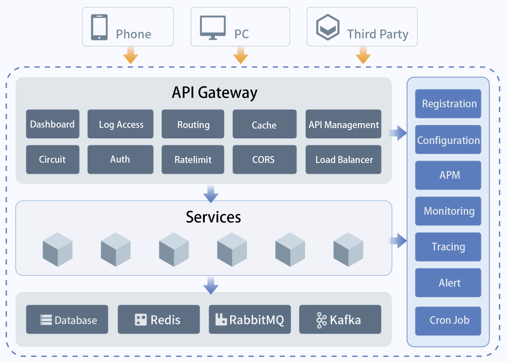

# DaoCloud Microservices Platform (DMP)

***DMP v2.5.0***

* Fully compatible with Spring Cloud microservices framework, providing highly reliable, high-performance enterprise microservices infrastructure components.
* Service management covers the entire lifecycle of microservices, supporting service metadata management, service grouping and searching, service on and offline, service (external access) routing policy, service fusion, service (external access) security policy, and service (external access) flow control policy.
* Service monitoring covers application monitoring (JVM and application-related metrics) and link tracing.

# Official Website

[www.daocloud.io](https://www.daocloud.io/dmp)

# Document Station Introduction

This document mainly introduces the operation instructions related to the access of DMP components. It also provides some common problems and solutions.
