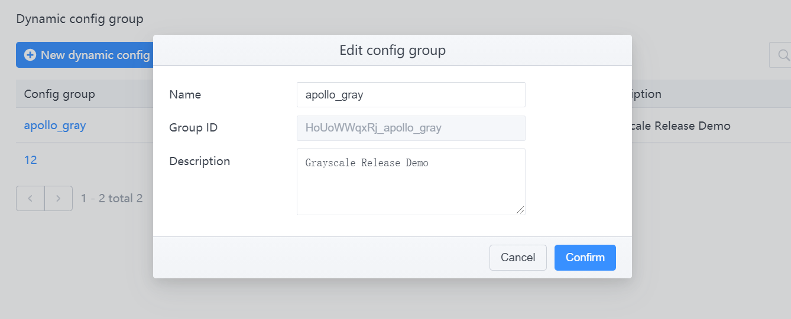
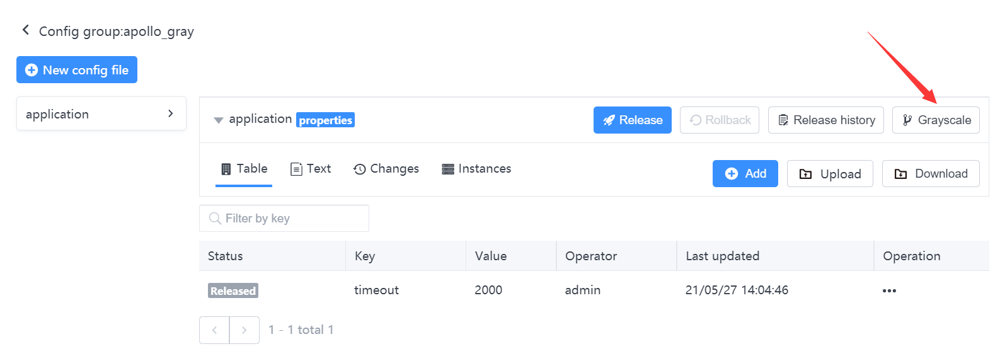
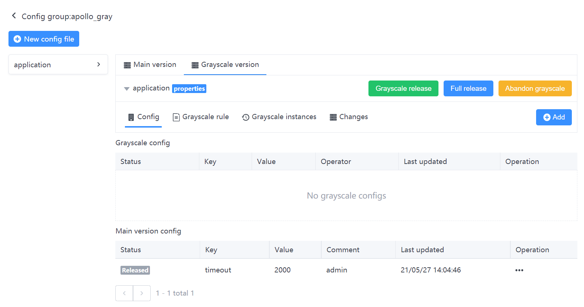
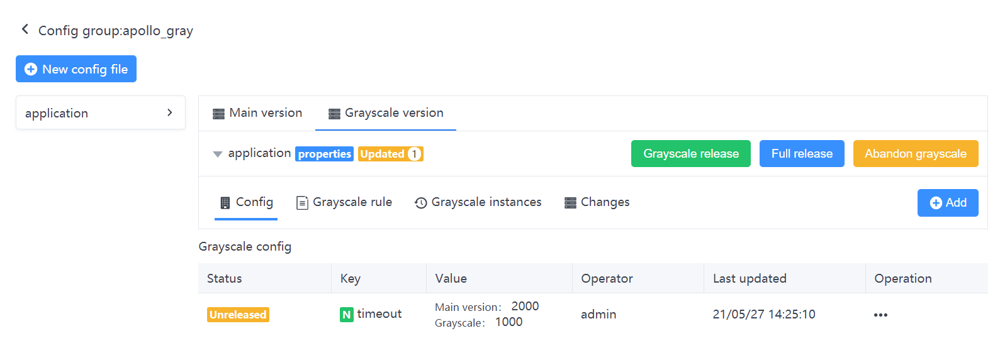
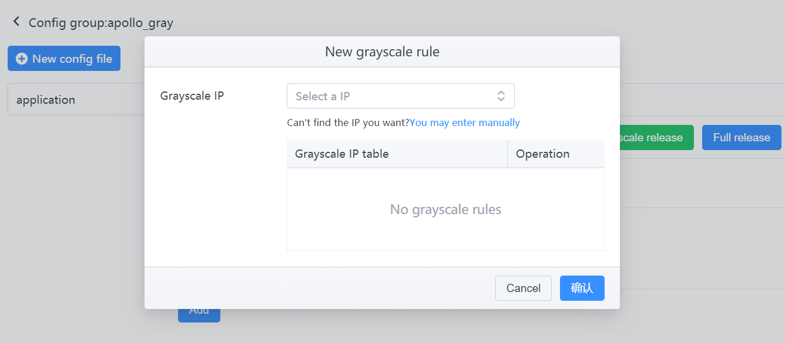
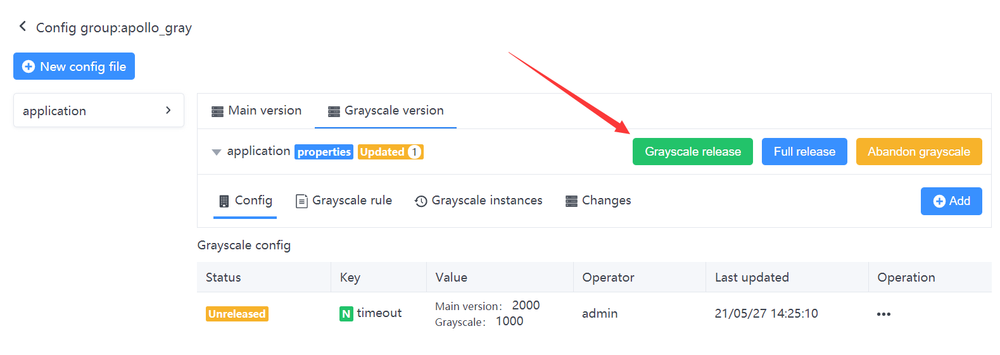
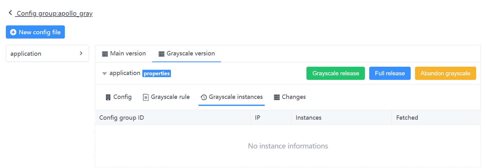
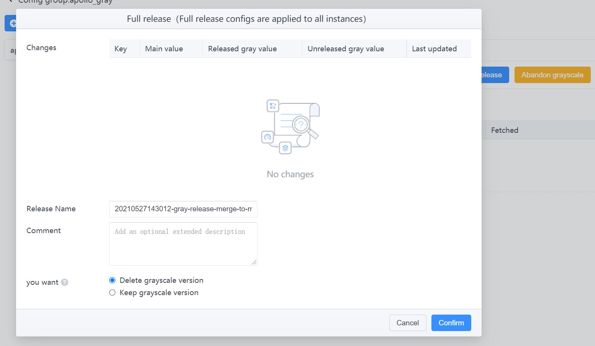
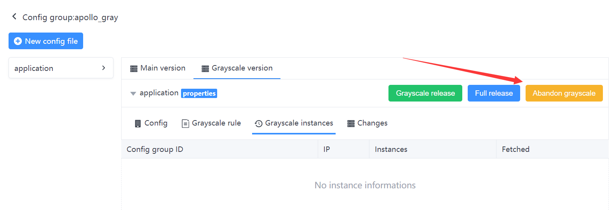

# Configuration Center Grayscale Release Usage Guide
> A/B Test is a kind of grayscale release, allowing some users to continue using A and some users to start using B. If users have no objection to B, then gradually expand the scope and migrate all users to B. Grayscale release can ensure the stability of the overall system, and problems can be identified and adjusted during the initial grayscale to ensure its impact.

With the gray release feature, it is possible to

- For some configurations that have a relatively large impact on the program, they can take effect in one or more instances first, and observe no problems for a period of time before releasing the configuration in full.
- For some configuration parameters that need to be tuned, `A/B` testing can be achieved through the grayscale release function. You can apply different configurations on different machines and keep tuning and evaluating for a period of time to find out the better configuration before releasing the configuration in full.

The following is a practical example to describe how to use the grayscale release function.

## Introduction to the operation process
- Create a configuration group in the configuration center
- Create a namespace in the configuration group
- Add grayscale rules to the created namespace
- Add a grayscale configuration
- Grayscale publishing
- Full [grayscale] release

### 1 Create a configuration group
There is an `appId=HoUoWWqxRj.apollo_gray` configuration group in the Configuration Center configuration group：


### 2 Creating namespaces
After creating a configuration group, an `application` namespace is created by default.
You can add configurations to this space, which at this point are called `master version` configurations.
For example:

```bash
timeout = 2000
```


### 3 Create grayscale

Once you click OK, the grayscale version is created successfully and the page will automatically switch to the `Grayscale Version Tab`.
After creating the grayscale branch, you will find the configuration of the main version appears at the bottom. At this point, you can create a grayscale value by overwriting that configuration with grayscale by using the action button at the bottom right corner. You can also add a new grayscale configuration directly (key=value).





This was followed by a `gray release`.

### 4 Create grayscale rules
Click `Edit Rule`, in the Instance IP list drop-down box will show the list of machines currently using the configuration by default, select the IP we want to gray out and click Finish. If you don't find the IP you need in the drop-down box, it means the machine hasn't taken the configuration from the configuration center yet, you can enter it by clicking Manual IP Input.


### 5 Grayscale Release
The configuration rules are in effect, but the grayscale configuration has not been published yet. Switch to the Configuration Tab.



### 5 Instance pulling configuration
Client access and how to pull configuration can be referred to the previous [open by annotation](annotation.md), [open by configuration file](bootstrap.md) introduction.
When the client pulls the configuration when the IP and the grayscale rules list match, the client will pull the grayscale configuration and appear in the grayscale instance list.
For example：


### 6 [Grayscale's] Full Volume Release

If the grayscale configuration tests down ideally and meets expectations, then you can operate the `full release`.

The effect of a full release is that

- The grayed-out version of the configuration is merged back into the main version, which in this case means that the `timeout ` of the main version is updated to `1000`.
- The main version of the configuration will be automatically published once
- On the full release page, you can choose whether to keep the current grayscale version, `default is `not keep`.



### 7 Discard grayscale
If the grayscale version is not satisfactory or not needed anymore, you can click `Discard Grayscale`.
