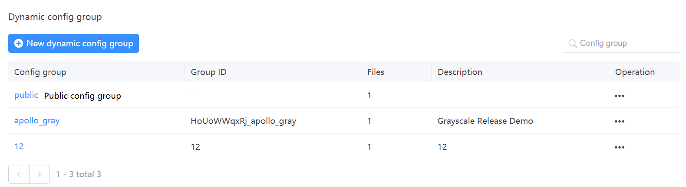

## Configuration Center Public Configuration Access Documentation

## I. Configuration Center Usage

### 1.1 Creating a public configuration

In the case that no public configuration group exists, clicking Create Configuration Group will give you the option to create a public configuration group.


When you click Confirm, the following configuration groups will be created. Only one public configuration group will exist for each environment.



### 1.2 Creating a public configuration space

After creating a public configuration group there will be a default public namespace named {env_code}.application.


Namespaces can be added by adding new public namespaces, and the names will all have {env_code}. prefix.
> The environment code for the example in the figure is public
## II. Client-side use

### 2.1 Using the public configuration by annotation

Other access steps remain the same, just change the parameters in @EnableApolloConfig

```java
 @SpringBootApplication
 @EnableApolloConfig({"public.application","application"})
 public class ApolloDemo3Application {
  public static void main(String[] args) {
        SpringApplication.run(ApolloDemo3Application.class, args);
     }
   }
```

**@EnableApolloConfig({"public.application","application"})** : where public.application is the public namespace and application is the private namespace under appId.
Note: The configuration that is placed first has higher priority than the one that follows.
